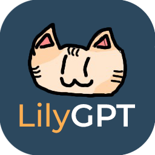

<div id="lilygpt" align="center">
  <a href="https://github.com/InfernoDragon0/LilyGPT-telegram">
    
  </a>

  <h3 align="center">LilyGPT</h3>

  <p align="center">
    A Telegram Bot powered by ChatGPT
    <br />
    <a href="https://github.com/InfernoDragon0/LilyGPT-telegram">View Demo</a>
    ·
    <a href="https://github.com/InfernoDragon0/LilyGPT-telegram/issues">Report Bug</a>
    ·
    <a href="https://github.com/InfernoDragon0/LilyGPT-telegram/issues">Request Feature</a>
  </p>
</div>

<!-- TABLE OF CONTENTS -->
<details>
  <summary>Table of Contents</summary>
  <ol>
    <li>
      <a href="#about-the-project">About The Project</a>
      <ul>
        <li><a href="#built-with">Built With</a></li>
      </ul>
    </li>
    <li>
      <a href="#getting-started">Getting Started</a>
      <ul>
        <li><a href="#prerequisites">Prerequisites</a></li>
        <li><a href="#setting-up">Setting Up</a></li>
        <ul>
            <li><a href="#telegram-bot-setup">Telegram Bot Setup</a></li>
            <li><a href="#openai-setup">OpenAI Setup</a></li>
            <li><a href="#application-setup">Application Setup</a></li>
        </ul>
      </ul>
    </li>
    <li><a href="#usage">Usage</a></li>
    <li><a href="#roadmap">Roadmap</a></li>
    <li><a href="#license">License</a></li>
    <li><a href="#acknowledgments">Acknowledgments</a></li>
  </ol>
</details>

# About The Project
LilyGPT is a Telegram Bot powered by ChatGPT

Using the OpenAI API, LilyGPT is able to generate text based on a prompt. The bot is able to generate text in a variety of different topics, such as names, descriptions, stories, etc. 

By using this bot, you can interact with ChatGPT directly through Telegram, as a means of convenience and/or entertainment. 

## Built With


<p align="right"><a href="#lilygpt">back to top</a></p>

# Getting Started
## Prerequisites

* npm
  ```
  npm install
  ```

## Setting Up

### Telegram Bot Setup
_If you already have a Telegram Bot's Token, you can skip <a href="#application-setup">here</a>_

1. 

#### OpenAI Setup
_If you already have an OpenAI Token, you can skip <a href="#application-setup">here</a>_
1. Open the <a href="https://platform.openai.com/account/api-keys">OpenAPI API Keys</a> page and login to your account
2. Click on the "Create new secret key" button
3. Copy the secret key, and do not lose it. <b>YOU WILL NOT BE ABLE TO SEE IT AGAIN</b>

_Remember to set "Usage Limits" if you are on a paid plan, to prevent unexpected billing_


### Application Setup
1. If not done, <a href="#prerequisites">install the required packages using npm</a>
2. Rename the `.env.example` into `.env`
3. Update the `.env` file with your Telegram Bot's Token and OpenAI Token accordingly
4. Rename `.config.example` into `.config`
5. Test the bot by typing `?name a cat for me` in the channel you registered

<p align="right"><a href="#lilygpt">back to top</a></p>

# Usage
- Type a prompt for the bot, starting with `?`, such as ```?name a cat for me```

<p align="right"><a href="#lilygpt">back to top</a></p>

# Roadmap
- [x] Add OpenAI to the bot
- [ ] Add commands to control the bot
- [ ] Add more features
- [ ] Add support for multiple groups/chats
- [ ] Add Codex support
- [x] Add Dall-E Support

<p align="right"><a href="#lilygpt">back to top</a></p>

# License
Distributed under the MIT License. See `LICENSE.md` for more information.

<p align="right"><a href="#lilygpt">back to top</a></p>

# Acknowledgments
* [OpenAI](https://openai.com/)
* [Telegraf.js](https://telegraf.js.org/)

<p align="right"><a href="#lilygpt">back to top</a></p>